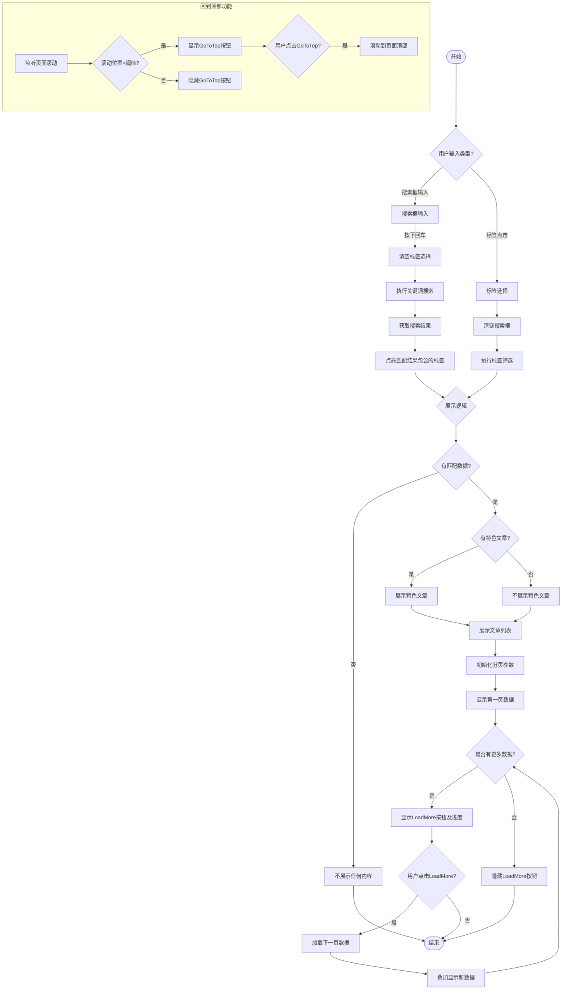

## Blog页面设计
### UI概要设计
- 搜索框，输入关键字后，按下回车键即执行搜索
- 分类(Tag)标签，可以单独选择进行分类(Tag)标签过滤结果；单独选择分类(Tag)标签时，清除搜索框的输入
- 页面中部，特色文章大卡片，只展示输入搜索或分类过滤的结果中，feature字段为true的第一个Blog，没有则不展示
- 页面下部左侧，Blog列表，按照N行3列布局，展示Blog卡片，loadMore按钮来执行分页逻辑，每页展示数量可配置
- 页面下部右侧，最近Blog列表，按照日期展示最近的3个Blog卡片

### 搜索筛选详细逻辑
- 搜索筛选的入口，只在两个地方：搜索输入框、分类标签按钮
- 搜索输入框和分类标签按钮是两套完全独立的筛选逻辑：
  - 执行输入框搜索时，清空用户选中的分类分类标签按钮，数据完全按照关键词来匹配
  - 执行分类标签按钮搜索时时，清空搜索输入框，数据完全按照分类标签来筛选
- 搜索的目的，根据关键词或者是分类标签去匹配数据，针对匹配的数据结果展现在页面中
- 展现数据：
  - 如果没有匹配的数据，那就不展示：没有特色文章(FeaturedPost)，也没有Blog列表
  - 如果有满足条件的特色文章(FeaturedPost)，那就展示，如果没有那就不展示
  - 如果有满足条件的Blog列表，那就展示，如果没有那就不展示
  - 最近Blog列表，不受搜索筛选条件限制，一直展示，除非没有数据
- 特殊处理：对于通过搜索框匹配到的数据，需要反显(点亮)分类标签按钮，即针对匹配到的数据，查找出数据中含有的Tag列表，点亮标签按钮
- 分页功能: 基于"展现数据"的规则，对Blog列表进行数据分页处理
  - 每页展示数量要支持配置，例如在appConfig中
  - 使用"loadMore"按钮加载显示下一页的数据, 注意之前页面的数据也要显示, 即每次都是叠加下一页的数据, 直到数据加载完毕
  - "loadMore"按钮上需要额外显示加载的进度, 例如 pages/Total Pages, 以提醒用户数据量信息
- 考虑到Blog列表数据加载越来越多，需要在网页右下角增加一个 回到顶部"GoToTop"按钮

### 搜索筛选流程图
